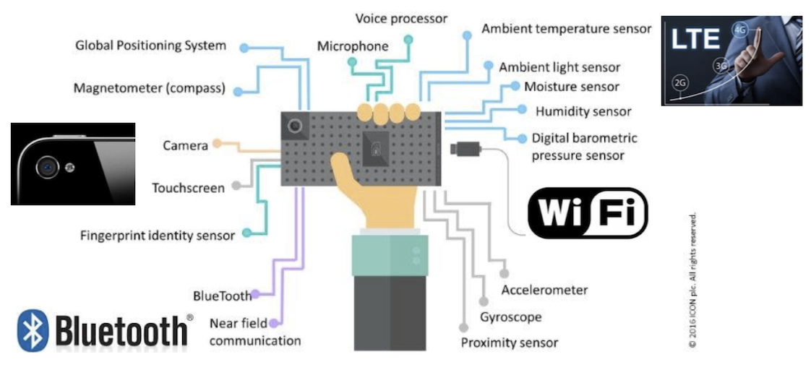
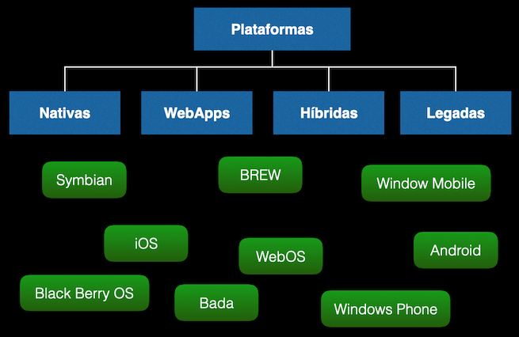
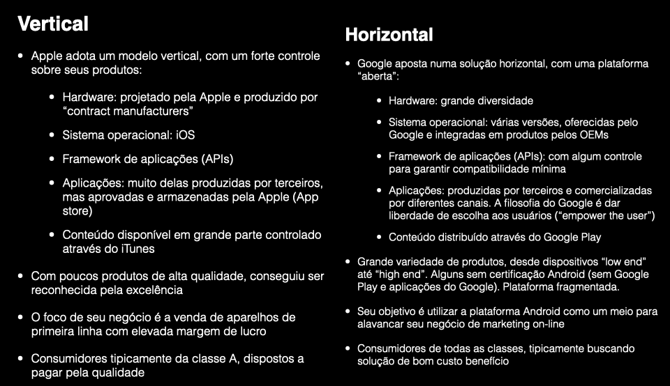

# Conceitos: Dispositivos Móveis (DM)

        19:05~19:20 (15 min)  

Ao se falar em Dispositivos Móveis pode se pensar em várias questões que envolvam está área. Por exemplo, Hardware envolvido, formas de desenvolver os Aplicativos (Software), e uso e aceitação no Mercado.  

## Hardware Móvel

Em relação ao Hardware o que se presencia é uma constante evolução e adoção de novos componentes em uma unidade móvel, que até a pouco tempo era impensável que poderia se tornar algo muitas vezes indispensável no nosso dia-a-dia. Ainda se tem um alto custo em certos tipos de equipamentos (as vezes valem "um rim" 😆), mas com a disponibilização de novos recursos tendem a ficar num preço acessível.  

Mas além da capacidade de aumentar o poder de processamento, ainda em paralelo se tem a miniaturização destes componentes, tornando cada vez mais possível o uso de equipamentos móveis vestíveis, os _wearables_ ([nosso próximo assunto](./DispositivosVestiveis.md "nosso próximo assunto")).  

Um aspecto importante a ser observado são as novas (não tão novas, mas sim cada vez mais factíveis) de interagir com estes dispositivos móveis. Como por exemplo, novas [opções de tela](#opções-de-tela "opções de tela"), [gestos](#uso-de-gestos "gestos"), [comandos por voz](#comandos-por-voz "comandos por voz"), [reconhecimento por imagem e/ou sensores a laser](#reconhecimento-por-imagem-ou-sensores-a-laser "reconhecimento por imagem e/ou sensores a laser"), e outros que ainda podem vir.

### Opções de Tela

As quantidade e variedade de opções de Telas disponíveis atualmente impressiona, mas ainda pode ficar melhor. Hoje se deve considerar resolução, quantidade de cores, contraste, durabilidade etc. E quem sabe, talvez, um smartphone com tela infinita.  
  

Bom, se especulando, a pergunta que também se deveria fazer e se no "futuro" os nossos Smartphones ainda terão alguma tela.  

### Uso de Gestos

Outro aspecto que se começou a ser explorado e o uso de gestos para interagir com o Smartphone. Desde de algumas tentativas não muito aceitas pelos usuários, como: poder rolar a tela com gesto da mão ou com a mudança do ponto de vista dos olhos, até sacudidelas (desfazer uma ação sacudindo o aparelho - iOS) que ainda estão em uso. Ou ainda, projeto com ações mais "descoladas" do aparelho, como o Google Soli Watch by LG Hands-On by ATAP.  
  

Ou algo mais recente como poder controlar o Apple Watch só usando gestos da sua mão ([Watch Assistive Touch](<https://tecnoblog.net/noticias/2021/05/19/apple-watch-tera-recurso-para-ser-controlado-sem-tocar-na-tela/> "Watch Assistive Touch")).  
  

### Comandos por Voz

Bom, qual assistente usar, temos: [Cortana](<https://pt.wikipedia.org/wiki/Microsoft_Cortana> "Cortana") (Microsoft), [Google Now](<https://pt.wikipedia.org/wiki/Google_Assistente> "Google Now") (Google), [Alexa](<https://pt.wikipedia.org/wiki/Amazon_Alexa> "Alexa") (Amazon), e a [Siri](<https://pt.wikipedia.org/wiki/Siri_(software)> "Siri") (Apple). Com tantas assistentes disponíveis, e cada vez mais se evoluindo, imagino que a curto prazo não precisaremos mais "trabalhar". Bom, cuidado com a volta do "Exterminador do Futuro" ... brincadeira, ainda estamos passando por um processo de evolução. Algumas características que marcam este avanço são:

- gradual aceite do usuário, ter de conversar com uma máquina.  
- melhora significativa no reconhecimento ([Speech-To-Text](<https://pt.wikipedia.org/wiki/Reconhecimento_de_fala> "Speech-To-Text")), síntese ([Text-To-Speech](<https://pt.wikipedia.org/wiki/S%C3%ADntese_de_fala> "Text-To-Speech"))  e interpretação de contexto usando o audio.  

Outro exemplo é a tentativa em começar a usar reconhecimento de audio do ambiente, como a recomendação em usar 20 segundos para lavar as mãos (Apple).

### Reconhecimento por Imagem ou Sensores a laser

Alguém sabe me dizer porque um smartphone precisa ter tantas câmeras? Bom, posso não saber, mas ter um aparelho com várias câmeras está na "moda", então deve ser "bom" (ah, e eu também quero um assim 🤩 ). Vamos com calma, podemos a grosso modo dividir os tipos de câmeras em dois grupos, as com objetivo de transformar o seu aparelho em um Studio Móvel que nem a MGM tinha uns anos atrás, e outras com objetivo de dar o "poder" ao seu aparelho de além enxergar, pode ver o mundo a sua volta.  

E esse "poder" começa a permitir que mesmo num aparelho móvel se use processos de inferência sobre o que se vê por intermédio do aparelho. Além dos usos de Visão Computacional (VC), se tem um avanço **enorme** na [Realidade Virtual](./RealidadeVirtual.md#conceitos-realidade-virtual-rv "Realidade Virtual"). Exemplo do uso de VC poderia ser um Aplicativo para detecçÃo do cancer de pele ([SkinCheck](<https://neosus.net/skincheck/#/> "SkinCheck")). O que permite se ter com duas câmera a percepção de profundidade usando a mesmo conceito da [Estereoscopia](./RealidadeVirtual.md#estereoscopia "Estereoscopia"), o que se conhece como Câmera _Truedepth_, possibilitando funcionalidades como o [_Face ID_](<https://pt.wikipedia.org/wiki/Face_ID> "Face ID") (Apple).  

E estas câmeras nos aparelhos móveis já podem vir com sensores a laser, parecido com a tecnologia usada nos [sensores do Kinect](<https://pt.wikipedia.org/wiki/Kinect> "sensores do Kinect"), o sensor [LiDAR](<https://pt.wikipedia.org/wiki/LIDAR> "LiDAR").  

### Futuro do Hardware Móvel

Em resumo, se tem várias formas de "entrada" e "saída" de informação nos aparelhos móveis, como pode ser observado:
  

Espero pode presenciar algo parecido com este projeto de conceito futurístico.  
  

## Software Móvel

Na história do desenvolvimento para plataformas móveis já passamos por uma estrutura deste tipo:
  

Atualmente temos duas grandes opções para desenvolver aplicações móveis. O desenvolvimento [Nativo](#desenvolvimento-nativo "Nativo") e [Multiplataforma](#desenvolvimento-multiplataforma "Multiplataforma"), ou ainda algumas poucas opções de [desenvolvimento direto com o usuário](#desenvolvimento-direto-com-o-usuário "desenvolvimento direto com o usuário").  

### Desenvolvimento Nativo

Quando se menciona em desenvolver nativamente significa que se usa o ambiente oferecido por uma plataforma (seja Apple ou Android) gerando uma aplicação somente para aquela plataforma. O desenvolvimento Nativo atualmente pode ser feito com:

- [Swift](<https://www.apple.com/br/swift/> "Swift") (Apple)  
- [Kotlin](<https://developer.android.com/kotlin?hl=pt-br> "Kotlin") (Android)  

Alguns aspectos devem ser considerados:

- vantagem por estar sempre atualizado com os avanços do hardware do aparelho e Sistema Operacional  
- desvantagem em ter que se manter uma equipe de desenvolvimento específica para plataforma escolhida (iOS ou Android)  

### Desenvolvimento Multiplataforma

Já a opção Multiplataforma se usa um ambiente que permite um único desenvolvimento, mas gerando uma aplicação para a plataforma Apple e outra aplicação para Android. Existem várias opções:

- [Unity](<https://www.unity.com> "Unity")  
- [Flutter](<https://flutter.dev/> "Flutter")  
- [React Native](<https://reactnative.dev> "React Native") (Facebook)  
- [Ionic](<https://ionicframework.com> "Ionic")  
- [Embarcadero](<https://www.embarcadero.com/?utm_source=Google&utm_medium=PPC&utm_content=Brand-Exact&gclid=Cj0KCQjwl7qSBhD-ARIsACvV1X2f0-zqIyfyoE8O6QK64VNjVsKK5lMgo3aRKXwc4Bv9JiXqd63RixIaAkKcEALw_wcB> "Embarcadero") (Delphi)

Alguns aspectos devem ser considerados:

- vantagem em poder manter uma única equipe de desenvolvimento para as duas plataforma (iOS ou Android)  
- desvantagem por estar "um pouco" desatualizado com os avanços do hardware do aparelho e Sistema Operacional  

### Desenvolvimento direto com o Usuário

Algumas opções de programação mais "alto nível" ([low-code](<https://en.wikipedia.org/wiki/Low-code_development_platform>) "low-code") estão começando aparecer como um opção direto no Sistema Operacional dos Smartphones. Por exemplo na Apple:  

- Atalhos ([Shortcuts](<https://en.wikipedia.org/wiki/Shortcuts_(app)> "Shortcuts"))  
- Saúde ([Health](<https://en.wikipedia.org/wiki/Health_(Apple)> "Health"))  
- Carteira ([Wallet](<https://pt.wikipedia.org/wiki/Apple_Wallet> "Wallet"))  
- [Handoff](<https://support.apple.com/pt-br/HT209455> "Handoff")  

## Mercado Móvel

Após o desenvolvimento se depara com a etapa de publicação nas lojas, que basicamente seguem estas duas "Regras de Negócio".  
  

A maior quantidade de Aplicativos ainda são os jogos, e por um bom tempo será um mercado dominante. Mas as **"modinhas"** atuais são [Realidade Virtual](./RealidadeVirtual.md "Realidade Virtual"), [Internet das Coisas](./InternetDasCoisas.md "Internet das Coisas") e Saúde. Existem produtos (WebSites) que permitem acompanhar estas tendências, como também se tem dados estatísticos disponibilizados quando seu Aplicativo é publicado em uma das lojas oficiais ([Apple](<https://apps.apple.com/> "Apple") e [Google](<https://play.google.com/store> "Google")).  

## Boas Práticas

Entre o que se pode sugerir como boas práticas para acompanhar está acelerada evolução dos dispositivos móveis destaco:

- acompanhar os grandes eventos de lançamentos de novos hardwares, sistemas operacionais e bibliotecas de desenvolvimento.
- acompanhar o mercado, mas realmente acompanhar, se tornar um usuário "fã".  
- pensar um passo a frente, a evolução é rápida.  
- pouco em muito bem feito. O usuário facilmente adota um aplicativo, mas mais rápido ainda o abandona por problemas pequenos. A concorrência é grande).  
- acompanhar as duas atuais maiores plataformas de dispositivos móveis.  
- a grande variedade de especificações em uso. Antes que perguntem, é quase impossível executar uma aplicação de [Realidade Aumentada](./RealidadeVirtual.md#realidade-virtual-aumentada-ra "Realidade Aumentada") (RA) num Nokia "tijolão". Use como uma "arma" de defesa pessoal, mas não para RA.  
- inove, mas não "reme contra a corrente" .. é cansativo e se perder clientes.  
- não reinvente a "roda", porque gastar recursos (tempo, verba etc.) para refazer o que o próprio [Hardware](#hardware-móvel "Hardware"), Sistema Operacional ou [Ambiente de Desenvolvimento](#software-móvel "Ambiente de Desenvolvimento") já oferecem como solução.  
- lembrar dos "vilões" dos dispositivos móveis: consumo de energia, falta de conectividade, problemas com privacidade, dependência para viver, etc.