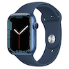
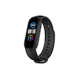
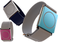
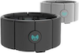
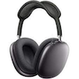
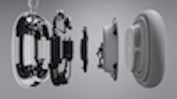
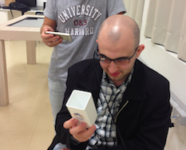
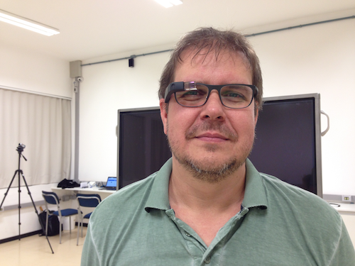

# Conceitos: Dispositivos Vestíveis (DV)

    19:25~19:35 (10 min)  

E os Vestíveis, apesar se já ter algumas iniciativas antigas, atualmente também estamos presenciando alguns avanços. Os conceitos básicos são:

- ubíqua: que está ou pode estar em toda parte ao mesmo tempo  
- onipresente: que está presente em todos os lugares, em todas as partes  
- pervasivo: espalhado; que tende a se espalhar, infiltrar, propagar ou difundir por toda parte  

Daí vem o termo, Computação Vestível, que é computação acoplada ao corpo e é conduzido pelos critérios:

- portável enquanto operacional, não ser restritiva  
- uso de mãos livres, não ser monopolizadora  
- sensores, atenta ao ambiente  
- chamar a atenção, ser comunicativa  
- ser observável pelo usuário  
- sempre ativo  

Exemplo de "sempre ativo" e a evolução da Siri no Apple Watch que antes se precisava apertar um botão para ativar a assistente. Depois só falar "E aí Siri...", e agora só levantar o braço.  

Os Smartphones como os Vestíveis, especificamente, devido à sua onipresença, apresenta a vantagem de oferecer “Stolen moments to work” (tradução livre, Momentos roubados para trabalhar)   

Bom, alguns exemplo ...

- Relógios e Pulseiras
  - [Apple Watch](<https://www.apple.com/br/watch/?afid=p238%7CsY3xpZTe6-dc_mtid_1870765e38482_pcrid_587962401790_pgrid_121684992424_&cid=aos-br-kwgo-watch--slid---product-> "Apple Watch")  
  

  - [Pulseira Inteligente Mi Smart Band 5](<https://xiaomidobrasil.com/products/mi-smart-band-5-versao-global?_pos=1&_sid=69c651e06&_ss=r&variant=36268456476837&gclid=CjwKCAjwur-SBhB6EiwA5sKtjnmwPjnyFjfCK2l7M56I_tqHxQv4-203etsFEbZeTrg_btUiF_4cyBoCdN4QAvD_BwE> "Pulseira Inteligente Mi Smart Band 5")  
  

  - Pulseira Embrace ([Empatica](<https://www.empatica.com/> "Empatica"))  
  

  - Pulseira Myo  
  
  

- Fones de Ouvido Espacial ([Apple AirPods Max](<https://www.apple.com/br/airpods-max/>) "https://www.apple.com/br/airpods-max/")  

  

Medidor de temperatura

Medidor de pressão

- Óculos Google Glass

  
