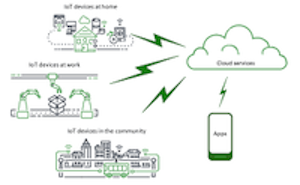

# Conceitos: Internet das Coisas (IoT)

    19:35~19:40 (5 min)  

E por fim, mas não menos importante, a Internet das Coisas (IoT). Basicamente consiste em buscar soluções de baixo custo para integrar de forma digital vários recursos físicos do nosso dia-a-dia. Como exemplo poderia ser pensar nas palavras deste conceito "Internet das Coisas", onde "Coisas" seriam equipamentos físicos os quais possam participar do processo computacional (Entrada/Processo/Saída) utilizando alguma conectividade ("Internet").  

O que todas elas tem em comum? Podemos observar:  

  

  

No caso podemos identificar três grupos:

- equipamentos eletrônicos do nosso dia-a-dia (só que mais "inteligentes") se conectando com uma central controladora local  
- uma unidade central controladora local (que as vezes pode não ser "fixa")  
- uma forma de se comunicar, interna ou externamente ao espaço de atuação (Internet)  

(IOT)  

    o que é  
    pontos positivos  
    pontos negativos  
    linha do tempo: passado / atual / .. futuro  

Exemplos do Aquário Virtual

Placas Arduino (coração)

Kits de sensores e atuadores

<https://github.com/dalton-reis/programa_EducacaoEspecial/blob/main/Braille.md#tcc-link-2019i-jader-a-tomelin---touch-braile-equipamento-acess%C3%ADvel>

<https://github.com/dalton-reis/programa_EducacaoEspecial/blob/main/Braille.md#tcc-link-2019ii-william-l-da-silva---blackglasses-assistente-para-deficientes-visuais-via-geolocalização>

----------

## ⏭ [Hardware e Exemplos](../README.md#hardware-e-exemplos "Hardware e Exemplos")  
