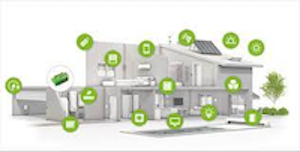
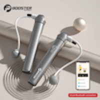

# Conceitos: Internet das Coisas (IoT)

    19:35~19:40 (5 min)  

E por fim, mas não menos importante, a Internet das Coisas (IoT). Basicamente consiste em buscar soluções de baixo custo para integrar de forma digital vários recursos físicos do nosso dia-a-dia. Como exemplo poderia ser pensar nas palavras deste conceito "Internet das Coisas", onde "Coisas" seriam equipamentos físicos os quais possam participar do processo computacional (Entrada/Processo/Saída) utilizando alguma conectividade ("Internet").  

O que todas elas tem em comum? Podemos observar:  

  

  

No caso podemos identificar três grupos:

- **equipamentos eletrônicos** do nosso dia-a-dia (só que mais "inteligentes") se conectando com uma central controladora local  
- uma unidade **central controladora local** (que as vezes pode não ser "fixa")  
- uma forma de se **comunicar**, interna ou externamente ao espaço de atuação (Internet)  

A forma de **comunicação** usa os meios atuais convencionais ([WIFI](<https://pt.wikipedia.org/wiki/Wi-Fi> "WIFI"), [Bluetooth](<https://pt.wikipedia.org/wiki/Bluetooth> "Bluetooth"), 4G, [RFID](<https://pt.wikipedia.org/wiki/Identificação_por_radiofrequência> "RFID")) para enviar e receber informações. A segurança é garantida pela camada de comunicação que se está utilizando. Também existem protocolos de comunicação próprios, como por exemplo o [MQTT](<https://pt.wikipedia.org/wiki/MQTT> "MQTT").  

Depois temos a **central controladora local**, que pode ou não existir de forma fixa no espaço porque em alguns casos o Smartphone assume este papel de controlar os equipamentos. Existem **central controladora local** dedicadas e específicas para algumas funções, que usam placas IoT de baixo custo, como o [Arduino](<https://pt.wikipedia.org/wiki/Arduino "Arduino"), série ESP ([ESP-32](<https://pt.wikipedia.org/wiki/ESP32> "ESP-32")), entre outras. Existe ainda a opção de usar alguma Assistente Pessoal (como visto em [Comandos por Voz](./DispositivosMoveis.md#comandos-por-voz "Comandos por Voz")).  

E por fim se tem os **equipamentos eletrônicos**, que podem ter mais ou menos integração com IoT. E podem usar um protocolo de próprio de interface ou seguir algum padrão, como o [HomeKit](<https://en.wikipedia.org/wiki/HomeKit> "HomeKit") da Apple.  

Alguns exemplos Externos

- Fechadura Automática  
  

- Controle de Luz  
  

- Pular Corda  
  
  

- SonOff  
  

- Teclado Virtual  
  

Alguns exemplo Internos:

- Aquário Virtual
  

- [Motor Agulha Braile](./InternetDasCoisas_imgs/MotorAgulhaBraile.png "")  
- [Braille Equipamento](<https://github.com/dalton-reis/programa_EducacaoEspecial/blob/main/Braille.md#braille-equipamento> "Braille Equipamento")  

- [BlackGlasses](<https://github.com/dalton-reis/programa_EducacaoEspecial/blob/main/Braille.md#tcc-link-2019ii-william-l-da-silva---blackglasses-assistente-para-deficientes-visuais-via-geolocalização> "BlackGlasses")  

----------

## ⏭ [Hardware e Exemplos](../README.md#hardware-e-exemplos "Hardware e Exemplos")  
