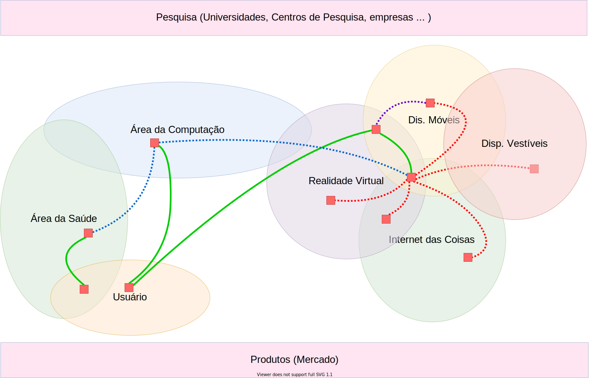

# Conceitos

  

- [Realidade Virtual](Conceitos/RealidadeVirtual.md "Conceitos sobre Realidade Virtual")  
- [Dispositivos Móveis](Conceitos/DispositivosMoveis.md "Conceitos sobre Dispositivos Móveis")  
- [Dispositivos Vestíveis](Conceitos/DispositivosVestiveis.md "Conceitos sobre Dispositivos Vestíveis")  
- [Internet das Coisas (IOT)](Conceitos/InternetDasCoisas.md "Conceitos sobre Internet das Coisas")  

O que estes assuntos tem em comuns

Algumas inquietações (dúvidas, curiosidades, preocupações, )

- relação temporal: passado, presente e "futuro"  
- 
