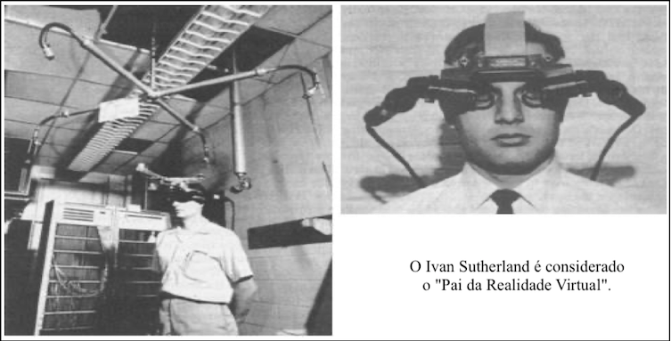

# Conceitos: Realidade Virtual (RV)

<!-- FIXME: preâmbulo -->

## Introdução

<!-- FIXME: preâmbulo -->

### Termos

**Imersão**: sentimento de estar-se dentro do ambiente.  

**Interação**: está ligada com a capacidade do computador detectar as entradas do usuário e modificar “instantaneamente” o mundo virtual e as ações sobre ele.  

**Envolvimento**: tange ao grau de motivação para a ligação da pessoa com uma determinada atividade.  

**Mundo Real**: mundo físico onde vivemos.  

**Mundo Virtual**: mundo modelado virtualmente por modelos de computação gráfica que podem simular o mundo real.  

### História

Sensorama - espécie de cabine, que combinava filmes 3D, som estéreo, vibrações mecânicas, aromas, e ar movimentado por ventiladores. Patenteado em 1962 por Morton Heilig, o Sensorama já utilizava-se de um dispositivo para visão estereoscópica.  
  

Primeiro capacete de realidade virtual (HMD) Helmet was made in 1967  
  

Sistema criado por Ivan Sutherland no ano de 1968, como o objetivo de adicionar informações virtuais sobre os objetos reais, facilitando as tarefas do dia a dia (AZUMA, 1995, p. 1). Como outras tecnologias a realidade aumentada também teve um grande incentivo financeiro das Forças Armadas dos Estados Unidos da América (EUA), o estudo tinha foco na geração de informações gráficas interativas, assim como de imagens mais realistas e melhores sistemas de rastreamento (tracking) de tecnologia (EKENGREN, 2009, p. 5) (HÖLLERER; FEINER, 2004, p. 2).  
  

O conceito da realidade aumentada de sobreposição de objetos virtuais em objetos reais trazendo mais informações veio somente nos anos 90. No ano de 1993, foi criado o primeiro sistema móvel de realidade aumentada para ambientes externos utilizando as coordenadas do GP S (Global Positioning System – Sistema de Posicionamento Global) pelos pesquisadores da Universidade da Califórnia, para servir como assistente de navegação para deficientes visuais, colocando voz à imagem captada.

## Tipos de Visualização

Video See-Through, Optical See-Through, Projetiva FIXME: mais formas, imagens para cada forma.  

## Tipos de Realidades

Uma forma de conceituar o que é Realidade Virtual e entender os tipos de realidades: Realidades Virtual (Imersiva), Realidades Virtual Diminuída, Realidades Virtual Aumentada, Realidades Virtual Misturada, Realidades Virtual Alternativa e Metaverso.

### Realidades Virtual Imersiva (RV / RVi)

A RV pode ser classificada conforme o nível de interação do usuário com o sistema de RV, em **imersiva** e **não-imersiva**. É **imersiva** quando o usuário é transportado para o domínio da aplicação de RV, com a utilização de ferramentas que auxiliem na imersão, como, por exemplo, capacete e luva para simulação de visão e tato, auxiliando a sensação de estar dentro de um mundo virtual. E é **não-imersiva** quando o usuário é transportado para o domínio da aplicação parcialmente, interagindo com um mundo virtual sem fazer parte dele, como, por exemplo, a utilização de monitor e projeção.

- Representação do mundo virtual que permita a imersão do usuário  
- Controlando os “sentidos” proporciona imersão, geralmente se usa HMD (displays estereoscópicos)  
- Poder interagir ou não com o que vê ao seu redor  

A Realidade Virtual Imersiva procura trazer o usuário da aplicação para o ambiente virtual, já a Realidade Aumentada, mantém o usuário no seu ambiente físico e transporta o ambiente virtual para o espaço do usuário, permitindo a interação com o mundo virtual, de maneira mais natural e sem necessidade de treinamento ou adaptação.  

### Realidades Virtual Aumentada  

As aplicações que usam Realidade Aumentada devem ter três características: combinar real com virtual, ter interação em tempo real e usar 3D.  

- Mistura do virtual com real  
- único sentido: do virtual p/ real ou real p/ virtual  
- Necessidade de marcadores (âncoras) no mundo real  

### Realidades Virtual Diminuída

"Esconde" objetos do mundo real com os do mundo virtual
<https://www.youtube.com/watch?v=l_GtDezeA2w>

Permite que o usuário remova objetos de vídeos em tempo real.
• Pode ser utilizado em conjunto com a realidade aumentada, para proporcionar uma
experiência visual única
• Utilizado normalmente em produções de vídeo/imagens, onde elementos não desejáveis
precisam ser removidos
• Dois tipos: Observacional e In Painting
• Observacional: utiliza imagens pré-capturadas ou existentes do plano de fundo. Então, quando os novos elementos são adicionados em cena, as imagens de plano de fundo são utilizadas como referência para remover o objeto que “obstruiu” a imagem.
• In Painting: Tenta “pintar” os objetos indesejados utilizando texturas da imagem de origem
<https://www.marxentlabs.com/diminished-reality-ken-moser-explains-marxent/>  

### Realidades Virtual Misturada

Mistura do virtual com real, e o real com o virtual

Combinação de processamento do computador, entrada humana e entrada do ambiente.
• Combina cenas do mundo real com o mundo virtual, e do virtual com o real.
• União de realidade aumentada e realidade virtual.
• Permite interação do usuário com o ambiente virtual.
• Pode ser utilizada na indústria, medicina, jogos e etc.

<https://docs.microsoft.com/pt-br/windows/mixed-reality/discover/mixed-reality>  

### Realidades Virtual Alternativa  

Jogo de realidade alternativa do Google chega ao iOS
<http://olhardigital.uol.com.br/noticia/jogo-de-realidade-alternativa-do-google-chega-ao-ios/43050>

Combinação de situações do virtual com o real.
• Transforma o mundo real em um cenário para a interação do usuário.
• Pokemon Go:
• Incentiva que os usuários saiam para capturar pokemons.
• Em locais públicos tem ginásios (para batalha) e pokestops.

### Metaverso  

### Interface de Usuário Tangível (IUT)

Um conjunto de componentes que auxiliam na interação entre um humano e um computador.  
Um conjunto de componentes que auxiliam na interação entre um humano e um computador de maneira tangível, ou seja, através do ambiente físico.  

Figura de um apessoa e o mundo e os sentidos (CG) percebem o mundo
Importância para "enganar" o usuário

Ilusão de Ótica

<https://github.com/dalton-reis/programa_EducacaoEspecial/blob/main/Braille.md#tcc-link-2020i-jonathan-m-kuntz---interface-de-usuário-tang%C3%ADvel-para-trabalhar-com-pensamento-computacional-no-furbot>

  

displays estereoscópicos (tais como os populares headsets, óculos
especiais para exibir o ambiente simulado)

    o que é  
    pontos positivos  
    pontos negativos  
    linha do tempo: passado / atual / .. futuro  

marcador no mundo físico

LiDAR e cameras .. pode colocar um objeto virtual depois de uma esquina ... usar uma parede do mundo real para ocultar parte do objeto.
Assim o objeto parece estar atrás da parede. Imagem da ilusão de ótica de um triangulo atrás de um circulo, mas na verdade e um triangulo e um come-come.

Ideias .. olhando TCC do Alan .. ter um aplicativo de RV Imersiva usando cardBoard para simular uma explicação de como funciona o exame de ressonância e tentar fazer um exame virtual antes para diminuir o medo do ambiente fechado.

AirTag

- Metaverso  

### Mundo Virtual x Mundo Real

- tudo no mundo virtual
- nos dois "mundos"
  - âncoras no mundo real
  - marcadores

### Na prática

- Cavernas Virtuais (Cave Virtual)
  
  
  
  

- Simuladores de Diversão

  

- VirtuSphere
large plastic globe in which people, wearing a head-mounted display, can put themselves in any kind of virtual environment.
University of Washington at Seattle being used in a military simulation
  

- Chroma Key  

- Aplicações usando óculos "dedicados"  

- Aplicações usando óculos "simples" + smartphones

----------

### Principais Referências Bibliográficas​

/Volumes/HD_APOIO/GIT/Projetos/programa_Habitat/habitat/bolsistas/AdamOliveira/pesquisaAquarioVirtual.pdf
AZUMA, 1995
EKENGREN, 2009 / HÖLLERER; FEINER, 2004

- CARBONI, Irenice de Fátima. **[Lógica de programação](https://bu.furb.br/consulta/portalConsulta/recuperaMfnCompleto.php?menu=rapida&CdMFN=265888)**. São Paulo : Pioneira Thomson Learning, 2003. 240 p, il.​
- MANZANO,