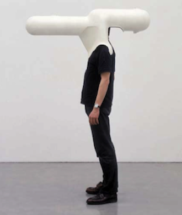

# Conceitos: Realidade Virtual (RV)

<!-- FIXME: preâmbulo -->

## Introdução

<!-- FIXME: preâmbulo -->

### Termos

**Imersão**: sentimento de estar-se dentro do ambiente.  

**Interação**: está ligada com a capacidade do computador detectar as entradas do usuário e modificar “instantaneamente” o mundo virtual e as ações sobre ele.  

**Envolvimento**: tange ao grau de motivação para a ligação da pessoa com uma determinada atividade.  

**Mundo Real**: mundo físico onde vivemos.  

**Mundo Virtual**: mundo modelado virtualmente por modelos de computação gráfica que podem simular o mundo real.  

### História

Sensorama - espécie de cabine, que combinava filmes 3D, som estéreo, vibrações mecânicas, aromas, e ar movimentado por ventiladores. Patenteado em 1962 por Morton Heilig, o Sensorama já utilizava-se de um dispositivo para <!-- FIXME: link para explicação sobre visão estereoscópica --> visão estereoscópica.  
  

Primeiro capacete de Realidade Virtual (Head Mounted Display - HMD) Helmet was made in 1967.  
  

Sistema criado por Ivan Sutherland no ano de 1968, como o objetivo de adicionar informações virtuais sobre os objetos reais, facilitando as tarefas do dia a dia (AZUMA, 1995, p. 1). Como outras tecnologias a Realidade Aumentada também teve um grande incentivo financeiro das Forças Armadas dos Estados Unidos da América (EUA), o estudo tinha foco na geração de informações gráficas interativas, assim como de imagens mais realistas e melhores sistemas de rastreamento (tracking) de tecnologia (EKENGREN, 2009, p. 5) (HÖLLERER; FEINER, 2004, p. 2).  
  

O conceito da Realidade Aumentada de sobreposição de objetos virtuais em objetos reais trazendo mais informações veio somente nos anos 90. No ano de 1993, foi criado o primeiro sistema móvel de Realidade Aumentada para ambientes externos utilizando as coordenadas do Sistema de Posicionamento Global (Global Positioning System - GPS) pelos pesquisadores da Universidade da Califórnia, para servir como assistente de navegação para deficientes visuais, colocando voz à imagem captada.

## Tipos de Visualização

<!--  FIXME: mais tipos, imagens para cada tipo. TCC do EvandroSchimit  -->
Video See-Through, Optical See-Through, Projetiva ...  

## Tipos de Realidades

Uma forma de conceituar o que é Realidade Virtual e entender os tipos de realidades: Realidades Virtual (Imersiva), Realidades Virtual Aumentada, Realidades Virtual Diminuída, Realidades Virtual Misturada, Realidades Virtual Alternativa e Metaverso.

### Realidade Virtual Imersiva (RV / RVi)

A RV pode ser classificada conforme o nível de interação do usuário com o sistema de RV, em **imersiva** e **não-imersiva**. É **imersiva** quando o usuário é transportado para o domínio da aplicação de RV, com a utilização de ferramentas que auxiliem na imersão, como, por exemplo, capacete <!-- FIXME: link --> e luva <!-- FIXME: link --> para simulação de visão e tato, auxiliando a sensação de estar dentro de um mundo virtual. E é **não-imersiva** quando o usuário é transportado para o domínio da aplicação parcialmente, interagindo com um mundo virtual sem fazer parte dele, como, por exemplo, a utilização de monitor e projeção.  
Alguns pontos que devem ser observados para aumentar a imersão:

- representar do mundo virtual que permita a imersão do usuário (quanto mais crível melhor);  
- controlar os “sentidos” proporciona imersão (mais comum: visão e tato);  
- poder interagir ou não com o que vê ao seu redor.

A Realidade Virtual Imersiva (RVi) procura trazer o usuário da aplicação para o ambiente virtual, já a Realidade Aumentada (RA), mantém o usuário no seu ambiente físico e transporta o ambiente virtual para o espaço do usuário, permitindo a interação com o mundo virtual, de maneira mais natural e sem necessidade de treinamento ou adaptação.  

### Realidade Virtual Aumentada (RA)  

As aplicações que usam Realidade Aumentada devem ter três características: combinar real com virtual, ter interação em tempo real e usar o espaço 3D.  

Alguns pontos que devem ser observados:

- mistura do virtual com real;  
- único sentido: do virtual para real ou real para virtual (mais comum);  
- necessidade de marcadores <!-- FIXME: link --> (âncoras) no mundo real.  

### Realidade Virtual Diminuída  

"Esconde" objetos no mundo real usando objetos do mundo virtual. Dois tipos:  

- *Observacional* utiliza imagens pré-capturadas ou existentes do plano de fundo. Então, quando os novos elementos são adicionados em cena, as imagens de plano de fundo são utilizadas como referência para remover o objeto que “obstruiu” a imagem;  
- *In Painting* tenta “pintar” os objetos indesejados utilizando texturas da imagem de origem.  

Alguns pontos que devem ser observados:

- utilizado normalmente em produções de vídeo/imagens, onde elementos não desejáveis precisam ser removidos;  
- pode permitir que o usuário remova objetos de vídeos em tempo real;  
- pode ser utilizado em conjunto com a realidade aumentada, para proporcionar uma
experiência de imersão maior;  

<!-- FIXME: baixar vídeo de exemplo <https://www.youtube.com/watch?v=l_GtDezeA2w> 
<https://www.marxentlabs.com/diminished-reality-ken-moser-explains-marxent/>  -->

### Realidade Virtual Misturada

Mistura do virtual com real, e o real com o virtual, nos dois "sentidos".  

Alguns pontos que devem ser observados:  

- combina cenas do mundo real com o mundo virtual, e do virtual com o real;  
- permite interação nos "dois" sentidos;  
- união de realidade aumentada e realidade virtual.  

"A realidade misturada é o próximo ciclo na computação, seguida por mainframes, PCs e smartphones."  

<!-- FIXME: <https://docs.microsoft.com/pt-br/windows/mixed-reality/discover/mixed-reality>   -->

### Realidade Virtual Alternativa  

Combinação de situações do virtual com o real.

Alguns pontos que devem ser observados:  

- transforma o mundo real em um cenário para a interação do usuário;  
- incentiva que os usuários se "movimentem" no mundo real para interagir com os objetos virtuais no mundo real.  

<!-- FIXME: 
Pokemon Go ("febre") .. além do entretenimento, outras funcionalidades ... algo que é "construído" com o apoio do coletivo (gratuito) ... Waze, notificações de ocorrências, velocidade etc.
Jogo de realidade alternativa do Google chega ao iOS
<http://olhardigital.uol.com.br/noticia/jogo-de-realidade-alternativa-do-google-chega-ao-ios/43050>
 -->

### Metaverso  

Metaverso é a terminologia utilizada para indicar um tipo de mundo virtual que tenta replicar a realidade através de dispositivos digitais. É um espaço coletivo e virtual compartilhado, constituído pela soma de "realidade virtual", "realidade aumentada" e "Internet". Este termo foi utilizado pela primeira vez em 1992, e exemplos mais recentes são os jogos VRChat, Second Life, Roblox, Fortnite, Facebook etc.  

Second Life é um jogo de 2003 criado pela Linden Lab. O propósito do Second Life era de criar uma realidade paralela onde usuários poderiam jogar, socializar, trabalhar, comprar e vender propriedades, entre outras atividades. Houve muito interesse nos primeiros anos do jogo, com cobertura jornalística do Estadão no jogo, exposições do Itaú Cultural e apresentação de bandas.  

Acreditando que o Metaverso é o futuro da internet e tecnologia, Mark Zuckerberg, CEO do Facebook, mudou em 2021 o nome de sua empresa para Meta Platforms Inc, ou Meta. Ele diz que a empresa irá abranger tudo o que eles acreditam, focando na construção do Metaverso. Bem como, outras grandes empresas seguem a mesma tendência. O

#### Críticas e preocupações

A privacidade das informações no Metaverso é uma área de preocupação porque as empresas envolvidas provavelmente coletarão informações pessoais dos usuários por meio de dispositivos móveis, vestíveis e interações com os usuários. O Facebook está planejando persistir em publicidade direcionada dentro do Metaverso, levantando mais preocupações relacionadas à disseminação de desinformação e perda de privacidade pessoal.  
O vício do usuário e o uso problemático das mídias sociais são outra preocupação para o desenvolvimento do Metaverso. O transtorno do vício em Internet, mídia social e vício em videogame podem ter repercussões mentais e físicas por um período prolongado de tempo, como depressão, ansiedade e obesidade. Os especialistas também estão preocupados que o Metaverso possa ser usado como uma 'fuga' da realidade de uma forma semelhante às tecnologias existentes da Internet.  
O Metaverso pode ampliar os impactos sociais das câmaras de eco online e dos espaços alienantes digitalmente. Uma vez que os desenvolvimentos do Metaverso podem ser feitos para adaptar os mundos virtuais algoritmicamente com base nas crenças de cada pessoa, o Metaverso pode distorcer ainda mais as percepções dos usuários sobre a realidade com conteúdo tendencioso para manter ou aumentar o envolvimento.  

<!-- FIXME: explicar melhor e ter um exemplo Exemplo da Apple que permite assistir um filme usando uma chamada de Facetime com outra pessoa distante. -->

### Interface de Usuário Tangível (IUT)

Um conjunto de componentes que auxiliam na interação entre um humano e um computador de maneira tangível, ou seja, através do ambiente físico.  

Então, "como percebemos o mundo a nossa volta" ...  
  

Figura de um apessoa e o mundo e os sentidos (CG) percebem o mundo
Importância para "enganar" o usuário

Ilusão de Ótica

<https://github.com/dalton-reis/programa_EducacaoEspecial/blob/main/Braille.md#tcc-link-2020i-jonathan-m-kuntz---interface-de-usuário-tang%C3%ADvel-para-trabalhar-com-pensamento-computacional-no-furbot>

  

displays estereoscópicos (tais como os populares headsets, óculos
especiais para exibir o ambiente simulado)

    o que é  
    pontos positivos  
    pontos negativos  
    linha do tempo: passado / atual / .. futuro  

marcador no mundo físico

LiDAR e cameras .. pode colocar um objeto virtual depois de uma esquina ... usar uma parede do mundo real para ocultar parte do objeto.
Assim o objeto parece estar atrás da parede. Imagem da ilusão de ótica de um triangulo atrás de um circulo, mas na verdade e um triangulo e um come-come.

Ideias .. olhando TCC do Alan .. ter um aplicativo de RV Imersiva usando cardBoard para simular uma explicação de como funciona o exame de ressonância e tentar fazer um exame virtual antes para diminuir o medo do ambiente fechado.

AirTag

- Metaverso  

### Mundo Virtual x Mundo Real

- tudo no mundo virtual
- nos dois "mundos"
  - âncoras no mundo real
  - marcadores

### Na prática

- Cavernas Virtuais (Cave Virtual)
  
  
  
  

- Simuladores de Diversão

  

- VirtuSphere
large plastic globe in which people, wearing a head-mounted display, can put themselves in any kind of virtual environment.
University of Washington at Seattle being used in a military simulation
  

- Chroma Key  

- Aplicações usando óculos "dedicados"  

- Aplicações usando óculos "simples" + smartphones

----------

## Principais Referências Bibliográficas​

/Volumes/HD_APOIO/GIT/Projetos/programa_Habitat/habitat/bolsistas/AdamOliveira/pesquisaAquarioVirtual.pdf
AZUMA, 1995
EKENGREN, 2009 / HÖLLERER; FEINER, 2004

- CARBONI, Irenice de Fátima. **[Lógica de programação](https://bu.furb.br/consulta/portalConsulta/recuperaMfnCompleto.php?menu=rapida&CdMFN=265888)**. São Paulo : Pioneira Thomson Learning, 2003. 240 p, il.​
- MANZANO,