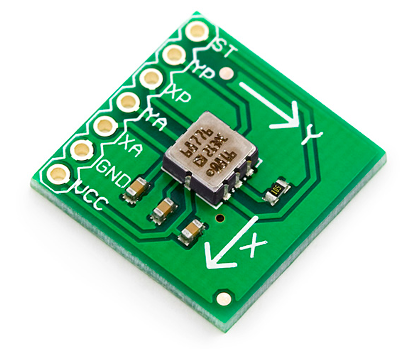

# Hardware e Exemplos

Para facilitar o entendimento de algumas tecnologias um pouco mais complexas podemos abstrair em algumas separações mais simples:

- Etapas: entrada / Processo / Saída
  
  
- Tipo de informação: raster (pixels/voxels) ou vetorial  
  - Sistemas Multimidia
    - texto (OCR)
    - imagem
    - audio
    - video
    - stremming
  
- Dimensão da informação: 1D, 2D, 2D 1/2, 3D, 4D, 5D .. nD
  
imagem dos eixos em CG, em Física e Medicina

- Tipo de Referência: absoluta / relativa  

a complexidade da tecnologia pensando 

Obtida: capacete (mais comum) ou com salas de projeção

Além do fator visual, os outros dispositivos, ligados aos sentidos restantes também são importantes, pois é necessário detectar a posição da pessoa, os controles reativos, etc.

# Exemplos de Hardware

    20:00~20:20 (20 min)  

: equipamentos e periféricos

Quais seriam os equipamentos necessário, ou que temos disponível, para poder usar nas áreas de:

- [Realidade Virtual](RealidadeVirtual.md "Conceitos sobre Realidade Virtual")  
- [Dispositivos Móveis](DispositivosMoveis.md "Conceitos sobre Dispositivos Móveis")  
  - Vestíveis (wearables)  
- [Internet das Coisas (IOT)](InternetDasCoisas.md "Conceitos sobre Internet das Coisas")  

## Óculos de Realidade Virtual (HMD - Head-Mounted Display)

    Dispositivo de Saída (alguns permitem entrada)  
  
- surgiu em 1967  

Alguns usos comuns dos HMD:

- Oculus Quest - Cinema  
- DeskTop do Computador (substituir a interface dos sistenas operacionais)  

### Mais encorpados

[Oculus Rift](HardwareExemplos/OculusRift.png "Oculus Rift")  
<https://www.roadtovr.com/oculus-rift-s-specs-release-date-announcement-gdc-2019/>  
  
Oculos Quest (Facebook)

Oculs Hole Lens (Microsoft)

  
<https://youtu.be/uIHPPtPBgHk>

Apple .. só especulação

### Só um suporte

Usar o smartphone como Unidade de Realidade Virtual

### Luva de Dados (Data Glove)

    Dispositivo de entrada  
  
- primeira foi criada em 1977  
- monitora os movimentos da mão  
- algumas permitem a detecção tátil  
- poucos avanços no desenvolvimento, muitos desenvolvedores optaram pelo uso de câmeras e
sensores para a captação dos movimentos  

  
<https://pt.wikipedia.org/wiki/Power_Glove>

  

LeapMotion

## Marcador no Mundo Físico

### Beacons

AirTag

### Sensor LiDAR

<https://github.com/dalton-reis/programa_EducacaoEspecial/blob/main/Braille.md#2021-ii-bruno-h-borba---explorar-digitalização-3d-em-tempo-real-utilizando-recursos-ios>

Apple LiDAR

ArKit Apple
  LIDAR (scanner) -> iphone 12 pro
  Light Detection and Ranging (LiDAR) - Detecção por Variação de Luz
O que o LiDAR pode contribuir para Realidade Virtual Imerssiva e Realidade Aumentada.
Uma parte importante deste material é quando ele cita que o LiDAR consegue obter em tempo real os dados 3D e serem processados em tempo real pelo ARKit. Além de poder obter a cor e intensidade de luz do ambiente real.
https://everypoint.medium.com/everypoint-gets-hands-on-with-apples-new-lidar-sensor-44eeb38db579

### Apple Watch

### Braçadera Myo

### Fones de Ouvido localização Espacial

### Acelerômetro

É um dispositivo usado para medir a aceleração própria de um sistema (explicação do "copo de água").
  
