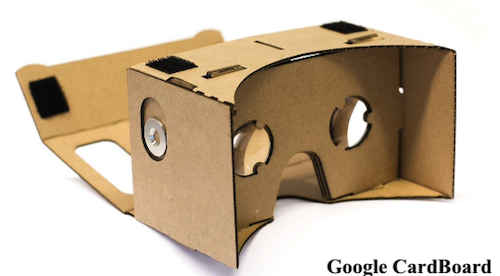
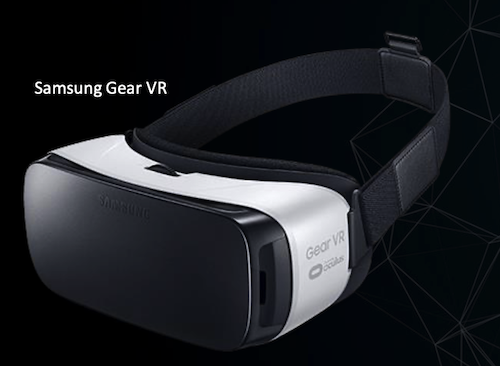
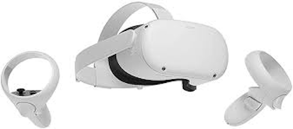
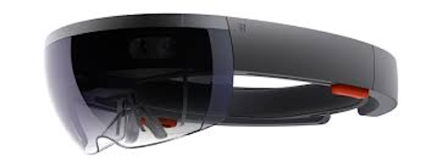

# Hardware e Exemplos

    20:00~20:20 (20 min)  

## Hardwares

Para facilitar o entendimento de algumas tecnologias um pouco mais complexas podemos abstrair em algumas separações mais simples:

- Tipo de informação: raster (pixels/voxels) ou vetorial  
- Dimensão da informação: 1D, 2D, 2D 1/2, 3D, 4D, 5D .. nD  
- Tipo de Referência: absoluta / relativa  
- Etapas: Entrada / Processo / Saída  

### Processo Computacional

  

As opções melhores são:

- Tipo de informação: raster
- Dimensão da informação: nD  
- Tipo de Referência: absoluta relativa  

Bom, agora vem a pergunta, quais seriam os equipamentos necessário, ou que temos disponível, para poder usar nas áreas de:

- [Realidade Virtual (RV)](../Conceitos/RealidadeVirtual.md "Conceitos sobre Realidade Virtual (RV)")  
- [Dispositivos Móveis](../Conceitos/DispositivosMoveis.md "Conceitos sobre Dispositivos Móveis")  
- [Dispositivos Vestíveis](../Conceitos/DispositivosVestiveis.md "Conceitos sobre Dispositivos Vestíveis")  
- [Internet das Coisas (IOT)](../Conceitos/InternetDasCoisas.md "Conceitos sobre Internet das Coisas (IOT)")  

### Óculos de Realidade Virtual (HMD - Head-Mounted Display)

    Tipo de informação: raster  
    Dimensão da informação: 2D
    Tipo de Referência: absoluta  
    Etapas: Saída (alguns são: E/P/S)

Curiosidade: surgiu em 1967  

Os HMDs podem ser um simples suporte para fixar o smartphone com quase nenhum componente eletrônico embarcado. Por exemplo algo deste tipo:  
  

Bom, na verdade algo deste tipo:  
  

Ou então o HMD ser uma unidade independente que não precise de um Smartphone:  
Óculos Rift  
  

Óculos GearVR - Samsung  
  

Óculos Quest - Facebook  
  

Óculos Hole Lens - Microsoft  
  

E da Apple .. só especulação.  

Mas se uso é bem antigo, e pode ser associado com outras formas para permitir explorar os outros sentidos, como visto nesta simulação de treinamento de paraquedistas.
  

Ou num treinamento militar com a opção de se "movimentar sem sair do lugar" ([Virtusphere](<https://pt.wikipedia.org/wiki/VirtuSphere>) "Virtusphere").  
  

### Luva de Dados (Data Glove)
  
    Tipo de informação: vetorial  
    Dimensão da informação: 3D  
    Tipo de Referência: absoluta / relativa  
    Etapas: Entrada  

Curiosidades:  

- primeira foi criada em 1977  
- monitora os movimentos da mão, mas nem sempre monitora a posição da mão no [mundo real](../Conceitos/RealidadeVirtual.md#mundo-real "mundo real")  
- algumas permitem o retorno tátil  
- poucos avanços no desenvolvimento, muitos desenvolvedores optaram pelo uso de câmeras e sensores para a captação dos movimentos  

Alguns exemplo:  

[Luva Power Glove](<https://pt.wikipedia.org/wiki/Power_Glove> "Luva Power Glove")  
  

Luva Articulada  
  

Uma outra opção seria o LeapMotion que também permite capturar os gestos das mãos com uma precisão muito boa, mas não se tem a sensação tátil. Mas tem a vantagem por não precisar vestir uma luva.  
  
[Exemplo de uso LeapMotion Cat Explorer](<https://www.youtube.com/watch?v=uBvNbpNTGrI> "Exemplo de uso LeapMotion Cat Explorer")  

### Beacons

Outro grupo interessante de hardwares são os Beacons que permite georreferenciar uma posição do mundo real utilizando uma conexão bluetooth. Existem vários tipos de Beacons como pode ser visto abaixo.  
  

E recentemente se tem uma opção da Samsung e da Apple (AirTag).  
  

### Acelerômetro

E ainda se tem os tradicionais, como o Acelerômetro, que é um dispositivo usado para medir a aceleração própria de um sistema.  
  

Explicação do "copo de água".  
  

## Exemplos

Alguns exemplos de uso dos Hardwares.  

- [Exemplos Externos](./ExemplosExternos/ "Exemplos Externos")  
- [Exemplos Internos](./ExemplosInternos/ "Exemplos Internos")  

----------

## ⏭ [Dinâmica - Ideias](../README.md#dinâmica---ideias "Dinâmica - Ideias")  
