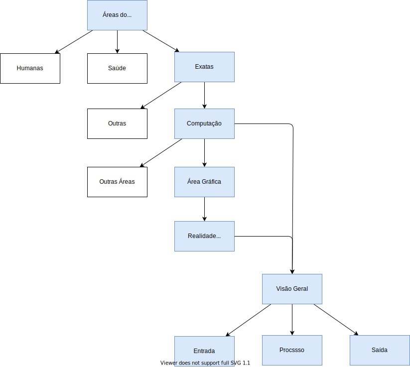

# Interação Mini

## Minha opinião

- O mais divertido e descobrir novas coisas (senso investigativo)  
- Sou meio professor (50%) e pesquisador (50%)  
- Além de "divertido", pode ser lucrativo  

## Por que Computação?

- Atualmente o que vale é o conhecimento  
- Importância da computação nas áreas de conhecimento  
- O papel da Universidade d da Computação no avanço tecnológico  

## Mapa

  

## Material

[RealidadeVirtual](../Conceitos/RealidadeVirtual.md "RealidadeVirtual")  
